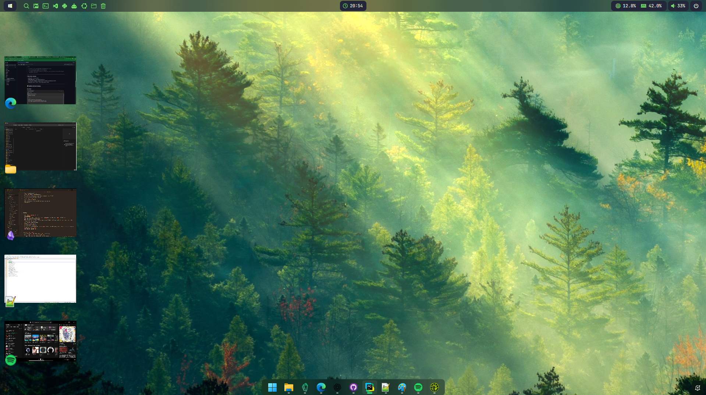

# Stage Sidebar


**Stage Sidebar** is a smart, elegant **window management sidebar** inspired by **macOS Stage Manager**, built with **Python + PySide6**.  
It displays **live thumbnails of minimized windows** on Windows 11, allowing you to quickly restore, preview, and manage applications in a clean and efficient interface.

---

## ✨ Features

- **Live window thumbnails:** displays real-time previews of minimized windows using `DwmRegisterThumbnail`.
- **Instant window management:** restore or close apps directly from the sidebar.
- **macOS-like layout:** organizes minimized windows visually, inspired by the Stage Manager experience.
- **Automatic event tracking:** updates instantly when windows are minimized, closed, or restored.
- **Multi-monitor support:** automatically aligns to the active monitor.
- **Floating icons:** each tile shows the app’s icon, which can be dragged and repositioned.
- **Highly customizable:** adjust size, spacing, alignment, titles, and behavior via JSON.
- **Optional hidden startup:** can launch hidden and toggle visibility on demand.
- **Low resource usage:** optimized with DWM differential updates and WinEvent hooks.

---

## 🖼️ Preview



> Example of Stage Sidebar showing minimized windows with live previews.

---

## 📦 Installation

### Option 1: Executable (.exe)

1. [Download the latest release](https://github.com/jrcn1991/app_stage_sidebar/releases/latest).  
2. Place it anywhere on your system.  
3. Run the `.exe` file.  
4. To start automatically with Windows, use the **Startup** folder or **Task Scheduler**.

### Option 2: Run from Source

1. Install **Python 3.9+** on Windows.  
2. Install dependencies:
   ```bash
   pip install PySide6 pywin32
   ```
3. Run the application:
   ```bash
   python main.py
   ```

---

## 🚀 Usage

### Sidebar
- Displays all minimized windows automatically.  
- **Left-click** on a tile to restore the window.  
- **Click the “X”** to close it directly.  
- Floating icons help identify apps visually.


---

## ⚙️ Configuration (`config/config.json`)

| Field | Type | Default | Description |
|--------|------|----------|-------------|
| `monitor` | int | 0 | Index of the active monitor. |
| `edge` | str | `"left"` | Sidebar position: `left` or `right`. |
| `bar_width` | int | 220 | Sidebar width in pixels. |
| `bar_height_pct` | int | 80 | Sidebar height as a percentage of the screen. |
| `visible_count` | int | 5 | Maximum number of visible thumbnails. |
| `icon_size` | int | 30 | Icon size on each tile. |
| `icon_anchor` | str | `"bottom-left"` | Anchor position for the icon. |
| `icon_allow_drag` | bool | `false` | Allows dragging the icon. |
| `show_title` | bool | `false` | Displays the window title above the thumbnail. |
| `maximize_on_restore` | bool | `true` | Maximizes windows upon restore. |

Example:
```json
{
  "monitor": 0,
  "edge": "left",
  "bar_width": 240,
  "visible_count": 6,
  "icon_size": 28,
  "icon_anchor": "bottom-left",
  "show_title": false,
  "maximize_on_restore": true
}
```

---

## 🧩 Project Structure

| File | Description |
|-------|-------------|
| `main.py` | Application entry point and global icon setup. |
| `sidebar.py` | Core logic for the sidebar and tile management. |
| `tile.py` | Implements the thumbnail widgets and overlays. |
| `win_utils.py` | Windows API integration (DWM, icons, hooks). |
| `config.py` | Configuration load/save management. |
| `docs/stage-manager-icon.png` | Main application icon. |

---

## ⚠️ Requirements

- **Windows 11** (not tested on Windows 10)  
- **Python 3.9+** (when running from source)  
- **Dependencies:** `PySide6`, `pywin32`

---

## 👨‍💻 Author

**Rafael Neves**  
🌐 [rafaelneves.dev.br](https://rafaelneves.dev.br)

---

## 📜 License

Distributed under the **MIT License**.  
Free to use, modify, and distribute.
